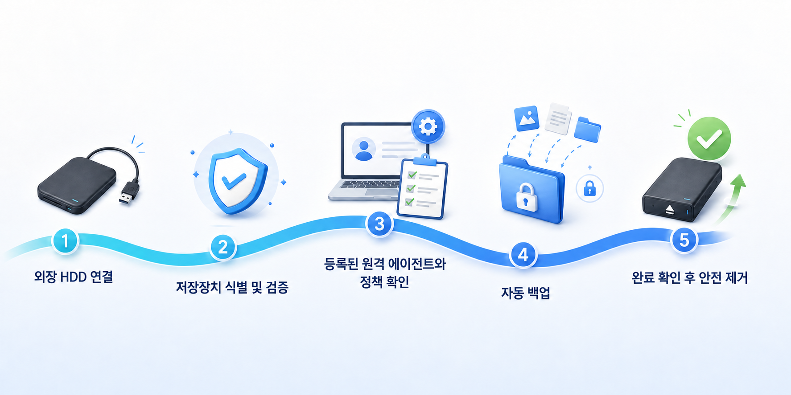
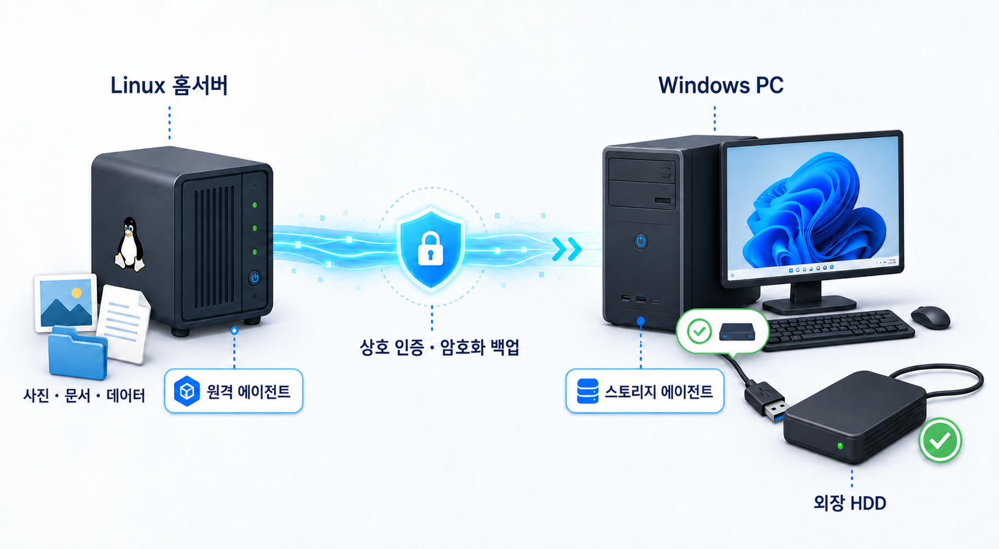

# BackupMesh

**한국어** | [English](README.md) | [사용자 가이드](docs/USER_GUIDE.ko.md)

**필요할 때만 연결하는 저장장치에도, 백업은 알아서.**

현재 버전: **0.3.3** — Storage 앱의 한국어·영어 지원, 프로젝트 정보와 GitHub 링크, 제거 시 설정 삭제 선택 기능을 추가했습니다. 자세한 내용은 [변경 기록](CHANGELOG.md)을 확인하세요.

BackupMesh는 백업할 데이터와 저장장치가 서로 다른 컴퓨터에 있어도, 저장장치가 사용 가능한 순간을 감지해 백업을 자동으로 시작하는 오케스트레이터입니다.

예를 들어 평소에는 안전하게 분리해 둔 외장 HDD를 Windows PC에 연결하면 BackupMesh가 저장장치를 확인하고, 등록된 Linux 서버의 데이터를 자동으로 백업합니다. 매번 명령을 실행하거나 네트워크 드라이브를 직접 연결할 필요가 없습니다.

## 왜 BackupMesh인가요?

### 오프라인 백업을 번거롭지 않게

백업 저장장치를 항상 연결해 두면 랜섬웨어, 실수, 장비 장애의 영향을 함께 받을 수 있습니다. 하지만 매번 직접 연결하고 백업 명령을 실행하는 방식은 결국 잊히기 쉽습니다. BackupMesh는 저장장치를 평소 분리해 두는 안전성과 자동 백업의 편리함을 함께 제공합니다.

### 저장장치를 알아보고 시작합니다

드라이브 문자나 폴더가 존재한다는 이유만으로 백업하지 않습니다. 등록된 저장장치의 identity를 검증하고, 준비 상태와 여유 공간, 정책을 확인한 뒤 백업을 시작합니다.

### Source와 Storage가 다른 컴퓨터여도 괜찮습니다

항상 켜져 있는 홈서버, Linux 장비, 데스크톱의 외장 HDD처럼 데이터와 저장장치가 떨어져 있는 환경을 하나의 백업 흐름으로 연결합니다.

### 백업 상태를 한눈에 확인합니다

Storage Agent에서 진행률, 처리한 파일과 데이터 크기, 예상 완료 시간, 마지막 성공 시각을 확인할 수 있습니다. 저장장치를 언제 제거해도 되는지 추측할 필요가 없습니다.

### 기존 백업을 지키는 방향으로 설계합니다

Remote Agent의 평상시 권한을 백업 생성에 필요한 범위로 제한하고, 삭제와 유지보수 권한을 분리하는 것을 기본 원칙으로 삼습니다. 전송 데이터와 저장된 백업은 암호화하며 Agent 간 통신은 상호 인증합니다.

### 백업 엔진에 갇히지 않습니다

초기 버전은 검증된 Restic을 활용하지만, BackupMesh의 핵심은 특정 백업 포맷이 아니라 저장장치의 가용성, 정책, 실행 상태를 연결하는 오케스트레이션입니다. 향후 다른 Storage Provider와 Backup Engine으로 확장할 수 있도록 설계합니다.

## 첫 번째 사용 시나리오

1. Linux 서버에 Remote Agent를 설치하고 백업할 경로를 등록합니다.
2. Windows PC에 Storage Agent를 설치하고 사용할 외장 HDD를 등록합니다.
3. 외장 HDD를 연결합니다.
4. BackupMesh가 저장장치를 검증하고 정책에 따라 백업합니다.
5. 완료 상태를 확인하고 저장장치를 안전하게 분리합니다.

## Windows Storage Agent

Windows 트레이 앱에서 물리 저장장치 또는 일반 로컬·네트워크 폴더를 논리 저장장치로 등록하고, 연동된 Remote Agent와 Backup Set을 확인한 뒤 각 Backup Set을 장치와 상대 repository 경로에 매핑할 수 있습니다. 하나의 장치에 여러 Source를 저장하거나, 하나의 Source를 여러 장치에 백업하는 구성을 모두 지원합니다.

Source를 연결하려면 트레이 앱에서 **Pair Remote Agent**를 선택하고 연결 초대를 복사하고 원격 컴퓨터에서 설정 파일 경로와 함께 `backupmesh-agent pair`를 실행한 뒤 초대를 한 번 붙여넣습니다. Source는 코드를 보내기 전에 Storage 인증서를 고정 검증하고 Source 전용 토큰·클라이언트 인증서·개인 키·Storage 신뢰 자료를 소유자 전용 권한으로 설치합니다. 새 연결은 개인 키를 전송 번들에 기록하지 않으며 운영체제 전역 신뢰 저장소도 변경하지 않습니다.

Linux 설치 프로그램은 repository 암호화를 위한 `/etc/backupmesh/restic-password`를 생성합니다. 이 암호를 잃으면 snapshot을 복원할 수 없으므로 별도의 안전한 위치에 복구 사본을 보관하세요.

## 설치와 기여

설치와 설정은 [사용자 가이드](docs/USER_GUIDE.ko.md)를 참고하세요. 개발 환경, 빌드 명령, 테스트와 기여 절차는 [기여 가이드](CONTRIBUTING.ko.md)에 정리되어 있습니다.

## 현재 상태

End-to-end MVP 구현을 마쳤습니다. 저장소의 테스트 흐름은 실제 파일을 인증된 방식으로 두 개의 폴더 저장 대상에 백업하고, 양쪽 snapshot을 복원한 뒤 SHA-256 일치를 검증합니다. 현재 릴리스에는 다음 구성이 포함됩니다.

- Linux용 Go Remote Agent
- Windows용 .NET Storage Agent
- Restic 및 rest-server 기반 암호화 백업
- 고정식·이동식·폴더 기반 저장장치 등록과 안정적인 identity
- 지연 실행, 진행률 표시, 안전 제거
- Agent 간 인증된 Control API

[사용자 가이드](docs/USER_GUIDE.ko.md)에서 설치, 페어링, 매핑, 복원 시험, 문제 해결 방법을 확인할 수 있습니다. 운영에 사용하기 전 실제 Windows·Linux 장비에서 인수 테스트를 반복하고, 직접 복원을 검증하기 전까지 BackupMesh를 중요한 데이터의 유일한 사본으로 사용하지 마세요.

## 라이선스

BackupMesh는 [Apache License 2.0](LICENSE)으로 배포됩니다.

배포판에는 BSD 2-Clause License가 독립적으로 적용되는 `restic`과 `rest-server`가 포함될 수 있습니다. 자세한 내용은 [외부 소프트웨어 고지](THIRD_PARTY_NOTICES.md)를 참고하세요.
