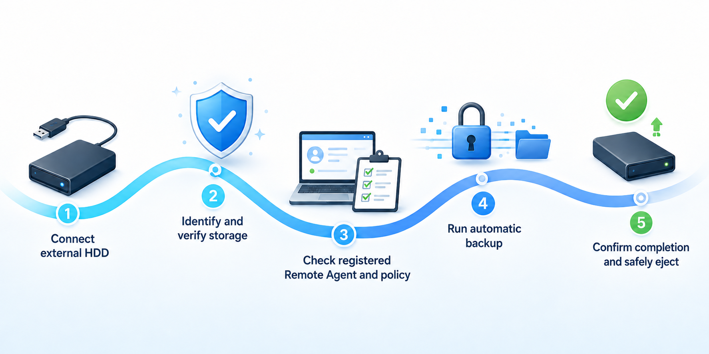
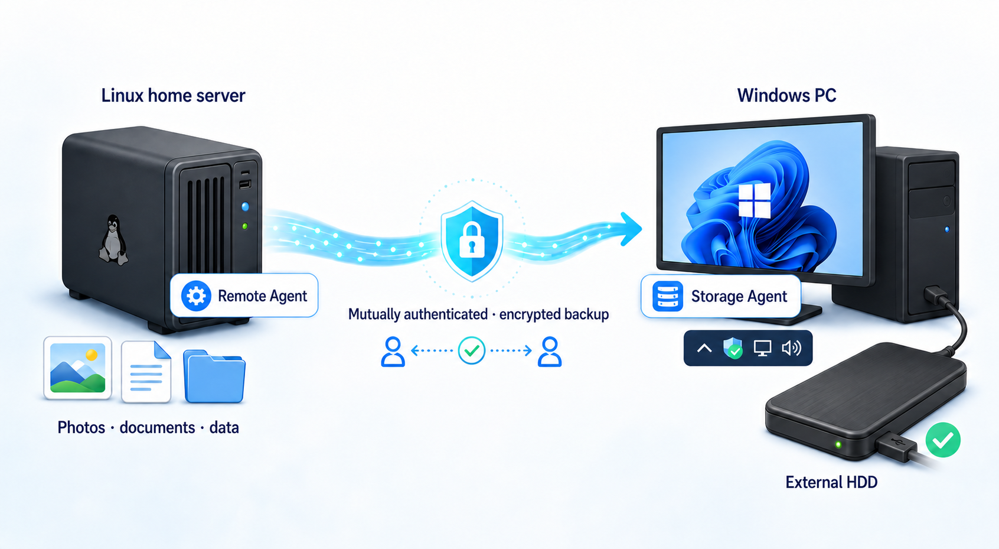
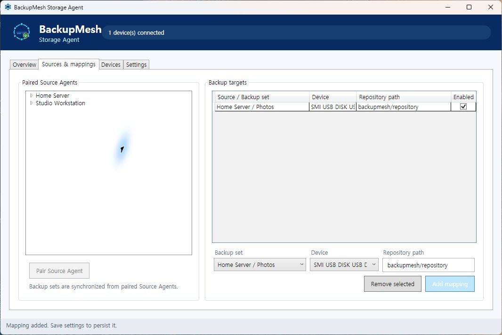

# BackupMesh

[한국어](README.ko.md) | **English** | [User guide](docs/USER_GUIDE.md)

**Plug in your backup storage. BackupMesh takes it from there.**

Upcoming release: **0.1.1** — the first end-to-end MVP with a guided Windows installer. The installer is available from source builds while elevated install/uninstall acceptance testing remains pending. See the [changelog](CHANGELOG.md).

BackupMesh is a storage-aware backup orchestrator. It detects when trusted storage becomes available and automatically backs up data from registered source computers—even when the data and storage live on different machines.

For example, keep an external HDD safely disconnected most of the time. When you attach it to a Windows PC, BackupMesh verifies the drive and automatically backs up your Linux server. There is no backup command to remember and no network drive to mount by hand.



## Why BackupMesh?

### Offline backups without the routine

A permanently connected backup drive can be exposed to ransomware, mistakes, and failures affecting the host. A manually disconnected drive is safer, but manual backup routines are easy to postpone or forget. BackupMesh combines the resilience of offline storage with the convenience of automatic backups.

### It recognizes the storage before it starts

BackupMesh does not start merely because a drive letter or directory exists. It verifies the registered storage identity, then checks readiness, free space, and policy before allowing a backup to run.

### Your source and storage can live on different computers

Connect an always-on home server or Linux machine to an external drive attached to your desktop. BackupMesh coordinates them as one backup workflow.

### Know exactly what your backup is doing

The Storage Agent shows progress, processed files and bytes, estimated completion time, and the latest successful backup. You do not have to guess whether the drive is safe to remove.

### Designed to protect existing recovery points

BackupMesh is designed to limit the Source Agent's normal permissions to creating backups, with deletion and maintenance privileges kept separate. Backup data is encrypted, and communication between Agents is mutually authenticated.

### Not locked to one backup engine

The first version builds on the proven Restic ecosystem. BackupMesh itself is an orchestration layer for storage availability, policy, execution, and observability—not a dependency on one repository format. Its architecture leaves room for additional Storage Providers and Backup Engines.

## First reference scenario



1. Install the Source Agent on a Linux server and register the paths to protect.
2. Install the Storage Agent on a Windows PC and register an external HDD.
3. Connect the HDD.
4. BackupMesh verifies the storage and runs the backup according to policy.
5. Confirm completion and safely eject the drive.

## Storage Agent for Windows

The Windows tray app keeps backup storage understandable without turning it into an always-on server. Register a physical device or an ordinary local/network folder as a logical storage device, review synchronized Source Agents and their Backup Sets, then map each Backup Set to a device and a relative repository path. The mapping model supports multiple Sources per device and multiple devices per Source.

To pair a Source, choose **Pair Source Agent** in the tray app and save the generated `backupmesh-pairing.json` bundle. Transfer it securely, then run `backupmesh-agent apply-pairing --config /etc/backupmesh/backupmesh.json --bundle backupmesh-pairing.json --output /etc/backupmesh/pairing`. This installs the identity-bound token, client certificate, private key, Storage Agent authority and remote Control API address, updates the Source ID and TLS paths, and protects the files with owner-only permissions on Linux. Delete the transfer bundle after applying it. Each Source receives an independent identity and credential.

The Linux installer creates `/etc/backupmesh/restic-password` for repository encryption. Store a protected recovery copy: BackupMesh cannot restore snapshots if this password is lost.



### Try the current Windows build

For the normal Windows experience, build `BackupMesh-Storage-0.1.1-win-x64-Setup.exe` with `pwsh -NoProfile -File scripts/build-windows-installer.ps1`, then run the installer. It installs the service, tray app, firewall rules, bundled tools, automatic startup, and uninstaller, and launches BackupMesh when setup finishes. Building the installer requires [Inno Setup 6](https://jrsoftware.org/isinfo.php).

The community preview installer is not yet Authenticode-signed, so Windows may display **Unknown publisher**. Verify the SHA-256 checksum from the GitHub release before approving installation.

From PowerShell in the repository, build a self-contained test package:

```powershell
pwsh -NoProfile -File scripts/build-windows-test-package.ps1
```

Then run `artifacts\BackupMesh-Storage-win-x64\Start-BackupMesh.ps1`. The launcher starts the local Storage Service, waits until it is ready, and opens the tray app. Closing the tray app also stops the test service. Configuration is kept under `%LOCALAPPDATA%\BackupMesh`.

For an always-on installation, open PowerShell as Administrator and run `Install-BackupMesh.ps1` from the built package. It installs the Storage Agent as an automatically restarting Windows service, starts it immediately, and registers the tray app for the current user's next sign-in. `Uninstall-BackupMesh.ps1` removes the service and startup entry while preserving configuration and repositories.

Build the self-contained Linux Source Agent package with `pwsh -NoProfile -File scripts/build-linux-source-package.ps1`. Copy `artifacts/BackupMesh-Source-linux-x64` to the source machine and run `sudo sh install.sh`. The package includes the pinned restic binary and systemd service/timer templates; the installer prints the validation and timer-enable commands after preserving or creating `/etc/backupmesh/backupmesh.json`.

## Project status

The end-to-end MVP is implemented. The repository test flow performs a real authenticated backup to two folder-backed targets, restores both snapshots, and verifies SHA-256 equality. The current release includes:

- A Go Source Agent for Linux
- A .NET Storage Agent for Windows
- Encrypted backups through Restic and rest-server
- Fixed, removable, and folder-backed storage registration with stable identity
- Delayed execution, progress reporting, and safe ejection
- An authenticated Control API between Agents

See the [user guide](docs/USER_GUIDE.md) for installation, pairing, mapping, restore testing, and troubleshooting. Before production use, repeat the acceptance tests on your actual Windows and Linux machines. BackupMesh should not be the only copy of important data until you have verified restoration yourself.

## License

BackupMesh is licensed under the [Apache License 2.0](LICENSE).

Distributions may bundle `restic` and `rest-server`, which remain independently licensed under the BSD 2-Clause License. See [Third-Party Notices](THIRD_PARTY_NOTICES.md) for details.
